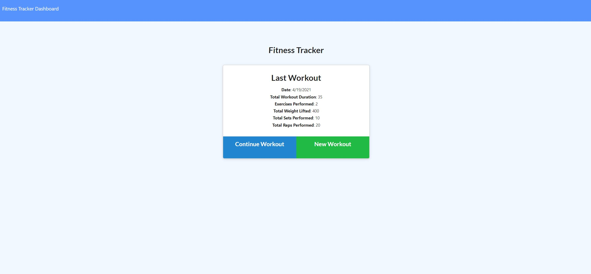
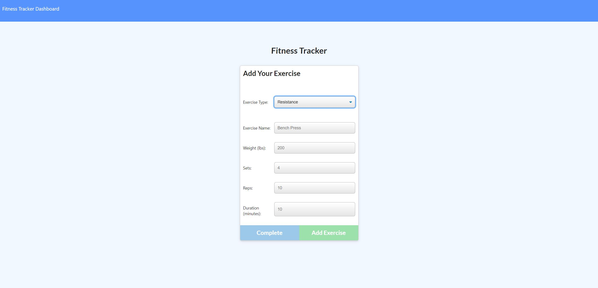
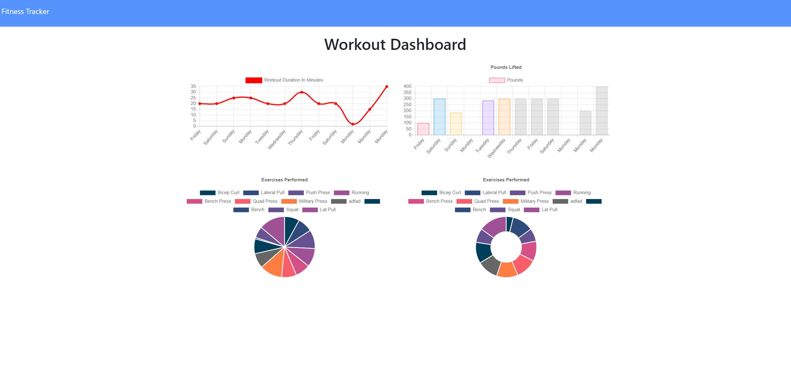

# Fitness-Tracker

## Description
    
i created a nosql storing workout app, hosted on a cloud server meaning that the entire deployment is in the cloud.
    
## Table of Contents
1. [Installation](#installation)
2. [Usage](#usage)
3. [License](#license)
4. [Questions](#questions)
5. [Credits](#credits)
    
## Installation
    
[Deployed Application](https://salty-coast-03002.herokuapp.com/)
    
## Usage

## License
    
MIT License
    
Copyright (c) 2021 Corbin Garner
          
## Questions?
    
[Github](https://github.com/CorbinGar)
    
For any questions, please send me an [email](CorbinGar@gmail.com).